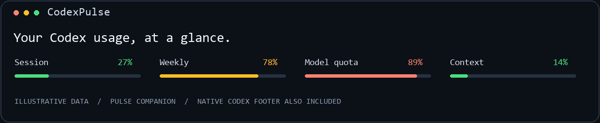
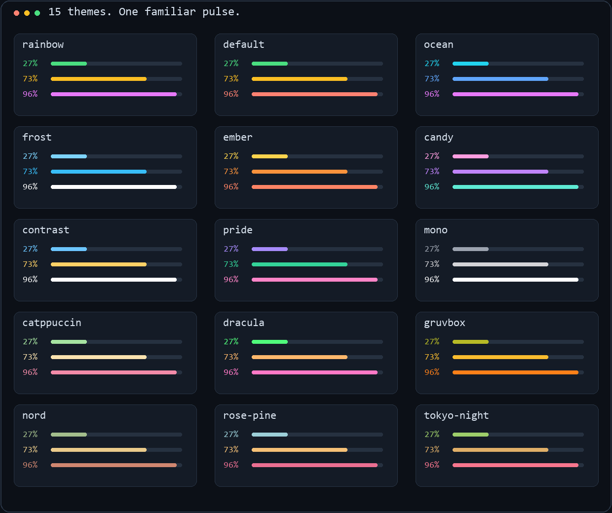

<p align="center">
  
</p>

<h1 align="center">Stop guessing how much Codex you have left.</h1>

<p align="center">
  CodexPulse brings the familiar Pulse experience to Codex CLI — usage limits, reset timers, context pressure, and the details that keep you moving.
</p>

<p align="center">
  <strong>Your existing Codex login. Zero runtime dependencies. Built for Windows, macOS, and Linux.</strong>
</p>

<p align="center">
  <a href="https://github.com/NoobyGains/CodexPulse/stargazers"></a>
  <a href="https://github.com/NoobyGains/CodexPulse/releases"></a>
  <a href="https://github.com/NoobyGains/CodexPulse/actions"></a>
  
  
  
</p>

<p align="center">
  
  <br />
  <sub>Illustrative data. The full companion display uses your account's actual windows and model buckets.</sub>
</p>

The familiar compact view:

```text
Session 39% 3h 31m | Weekly 78% R:Wed 10pm | Model quota 89% | Context 14%
```

Or progress bars, model, reasoning, and Git context:

```text
Session ━━━━──────── 39% 3h 31m | Weekly ━━━━━━━━━─── 78% R:Wed 10pm
Context ━━────────── 14% | codex-model | Effort high | main
```

**Two displays, one project.** The **native footer** lives inside Codex CLI and uses its supported built-in status items. The **Pulse companion** runs in a terminal pane below Codex and supplies the full themes, bars, animations, timers, and extra widgets. Codex's documented `tui.status_line` accepts item identifiers, not a script command. Pulse does not patch the Codex executable or inject a footer into the desktop app. [Official configuration reference](https://learn.chatgpt.com/docs/config-file/config-reference)

Native Codex labels quota **remaining**; the companion labels quota **used**, matching Claude Pulse. For example, `75% left` and `Weekly 25%` describe the same usage.

The companion also has an **adaptive display**: `--native-mode auto` reads the configured native footer and keeps complementary bars and reset timers while omitting duplicated percentages and metadata. `--native-mode off` restores the complete standalone display. Detection reads configuration, not another window's pixels; command-line overrides or a different session can differ. [Adaptive display details](ADAPTIVE-DISPLAY.md)

## Install — about a minute

Install [Codex CLI](https://learn.chatgpt.com/docs/codex-cli), Python 3.11+, and Git, then run `codex login` once.

### Windows (PowerShell)

```powershell
irm https://raw.githubusercontent.com/NoobyGains/CodexPulse/main/install.ps1 | iex
```

Restart Codex for the native footer. To open Codex with a live Pulse pane underneath, run this from your coding project:

```powershell
python "$HOME/.codexpulse/project/codex_status.py" --launch
```

### macOS / Linux

```sh
curl -fsSL https://raw.githubusercontent.com/NoobyGains/CodexPulse/main/install.sh | sh
```

Restart Codex for the native footer. Open a small terminal split and run:

```sh
python3 ~/.codexpulse/project/codex_status.py --watch --cwd /path/to/your/project --native-mode off
```

The installers check prerequisites, clone a separate project, back up Codex configuration, configure its footer, and install the `$codexpulse` conversation helper. They do not install system packages or change Claude's settings. An existing destination is left for you to update explicitly.

<details>
<summary>Manual install, existing checkout, or pip</summary>

```sh
git clone https://github.com/NoobyGains/CodexPulse.git
cd CodexPulse
python codex_status.py --install
python codex_status.py --install-skill
python codex_status.py --doctor --cwd /path/to/your/project
```

Use `python3` where your system names it that way. Running `./install.ps1` or `sh install.sh` from a checkout uses that checkout. Set `CODEX_HOME` for a non-default Codex profile directory and `CODEXPULSE_HOME` for non-default Pulse state. The remote PowerShell installer accepts `-InstallDir` when saved and run as a file; the shell installer accepts `CODEXPULSE_INSTALL_DIR`.

Optional command installation:

```sh
python -m pip install .
codexpulse --preview
codexpulse --watch --cwd /path/to/project
```

Pip installs the companion command. `--launch` and `--install-skill` require the git checkout because they use its companion files. On Windows, npm's Codex shim is resolved through Node with argument arrays, including paths containing spaces. `CODEXPULSE_CODEX` can select a native Codex executable explicitly.

</details>

## Why CodexPulse

- **Codex-native data.** Quotas come through `codex app-server` using your existing login. Pulse never reads or refreshes your authentication tokens itself. [Official app-server API](https://learn.chatgpt.com/docs/app-server)
- **Real window durations.** Five-hour, weekly, and other windows are classified from their reported duration. A weekly primary window stays weekly.
- **Model-specific limits.** Additional buckets use the labels Codex provides; no hardcoded Claude models or imaginary per-model caps.
- **Fifteen themes, five animation modes, eight bar styles.** Familiar Pulse customization in the companion.
- **Honest context and costs.** Context uses the latest request's tokens, never cumulative session tokens. Missing measurements stay unknown. Cost appears only when Codex provides an estimate.
- **Quiet refreshes.** Local display refresh and animation are separate from network polling; quota reads are cached for 60 seconds by default, with failure backoff.
- **Reversible setup.** Codex writes its own configuration. Pulse keeps a backup and refuses to overwrite later user edits during uninstall.

## Feature tour

| Feature | What CodexPulse provides |
|---|---|
| Session and weekly usage | Actual used percentages, local reset time, countdown, and expired-data markers |
| Additional model budgets | Every model/limit bucket the account reports, with its actual window duration |
| Context pressure | Last reported context percentage, token count, and a warning at 90% |
| Model and reasoning | Current thread model and effort, plus observed fast/priority service tier when recorded |
| Token detail | Cumulative input, output, reasoning, total tokens, and cached-input share |
| Git context | Branch, worktree, changed-file count, tracked working-tree diff, ahead/behind upstream |
| Live companion | Independent animation frames, periodic metadata reads, and configuration reloads |
| Activity | Last recorded activity, tool count, last tool, elapsed time, and recorded compactions |
| Agents | Direct children present in the latest 100 subagent results; server-reported activity is shown without guessing |
| Costs and budget | Codex-provided thread cost estimate where supported, an optional USD ceiling, and explicit currency conversion |
| Focus timer | Start, pause, resume, stop, and completion indicator |
| Trends | Local quota sparkline, observed burn rate, approximate runway, and usage-versus-time pace |
| Account stats | Official lifetime tokens, activity streak, and daily token heatmap when available |
| Layout | Four layouts, widget priorities, optional second row, Unicode-aware width fitting and wrapping |
| Configuration | Preview, fifteen-theme picker, presets, twenty-step undo, and `$codexpulse` helper |
| Maintenance | Doctor, explicit release checks, clean-tree fast-forward updates, and reversible native install |

<details>
<summary><strong>What changes from Claude Pulse?</strong></summary>

This is a Codex adaptation, with different integration boundaries. It does **not** claim exact Claude-plugin parity:

| Claude Pulse feature | Codex adaptation / boundary |
|---|---|
| Custom in-process status-line script | Native footer setup plus a separate full-featured companion pane |
| Opus / Sonnet / Fable caps | Codex-reported bucket names and windows only |
| Claude hook heartbeat and subagent rows | Local Codex rollout activity and optional child-thread summaries; no Claude hooks installed |
| Claude's session cost field | Codex thread cost estimate when available; hidden otherwise, including unsupported subscription routes |
| Live FX and cumulative monetary cost | Explicit exchange rate; official account token totals replace unsupported account money totals |
| Session lines changed | Current Git working-tree diff against HEAD; includes staged and unstaged tracked changes, excludes untracked contents |
| Clickable PR widget | Use Codex's own `/statusline` picker for PR support when offered by your CLI version |
| Per-agent context rows / spawn caps | Not installed; Codex does not expose Claude's `subagentStatusLine` contract or its spawn budgets |
| Context velocity alerts and celebration effects | Current-pressure warning and quota trends; no speculative velocity alert or reset celebration |
| Automatic update badges | Explicit `--check-updates`; no background release requests |

Unknown data is omitted or marked `?`. The companion follows the latest stored thread in the chosen directory, which can be an existing app or CLI session until the new CLI persists a turn. Use `--thread <id>` to pin a particular session. The native footer always belongs to its own CLI session.

Activity and context are **last recorded telemetry**, not a direct subscription to another CLI process. A separate app server may report child threads as `notLoaded`; Pulse does not label that state as active. Rollout reads are bounded to 4 MiB on initial load and incremental afterwards. A partial history labels its tool count as **recent tools**. This local rollout format is an unstable compatibility fallback; missing/changed fields remain unknown.

</details>

## Themes

<p align="center">
  
</p>

`rainbow`, `default`, `ocean`, `frost`, `ember`, `candy`, `contrast`, `pride`, `mono`, `catppuccin`, `dracula`, `gruvbox`, `nord`, `rose-pine`, `tokyo-night`.

```sh
python codex_status.py --theme ocean
python codex_status.py --show-themes
python codex_status.py --pick-theme
python codex_status.py --theme candy --preview
```

The picker accepts a theme name or number, previews all themes, and saves only the chosen result. `--preview` and `--show-themes` are offline dry runs. Themes apply to the companion. Configure Codex's own appearance with its native controls.

### Animation and bar styles

```sh
python codex_status.py --animate rainbow --animation-speed normal
python codex_status.py --bar-style braille --bar-size medium
```

| Animation | Effect |
|---|---|
| `off` | Static |
| `rainbow` | Moving rainbow across filled bar cells |
| `pulse` | Filled bars cycle through colors together |
| `glow` | Brightness wave across the filled bar |
| `shift` | Moving highlight |

Styles: `classic`, `block`, `shade`, `pipe`, `dot`, `square`, `star`, `braille`. Sizes: `small`, `small-medium`, `medium`, `medium-large`, `large`. Animations repaint at five frames per second in watch mode without extra quota requests. Minimal layout has colored percentages and no bars to animate. `NO_COLOR` and `--plain` disable ANSI color; `--color-depth` supports truecolor, 256, and 16-color terminals.

## Configure it by talking to it

After installation, start a new Codex session and type:

```text
$codexpulse make it ocean blue and show cache efficiency
$codexpulse put model and reasoning on a second line
$codexpulse start a 25-minute focus timer
```

The installer copies the helper skill to your Codex skills directory. A validated plugin manifest and the same skill are also included under `plugins/codexpulse` for custom marketplace packaging. The helper configures the installed project; it is not a custom footer renderer inside Codex.

<details>
<summary><strong>Configuration reference</strong></summary>

```sh
# Exact compact arrangement, with only the available quota windows
python codex_status.py --preset minimal --layout minimal --native-mode off

# Rich display with a second row
python codex_status.py --preset full --line2 model,effort,branch,tokens,cache

# Complement the native footer in a short companion pane
python codex_status.py --native-mode auto --no-header --bar-style dot --animate glow

# Toggle / order widgets
python codex_status.py --show cache,tokens,focus --hide branch
python codex_status.py --priority model=0,session=10,weekly=20

# Pin a session instead of following the latest one in a directory
python codex_status.py --watch --thread YOUR_THREAD_ID

# Configure reset labels and optional estimated spend
python codex_status.py --clock 24h
python codex_status.py --show cost,budget --budget 20
python codex_status.py --currency SGD --fx-rate 1.30

# Timers, history, and account activity
python codex_status.py --focus start 25
python codex_status.py --focus pause
python codex_status.py --focus resume
python codex_status.py --focus stop
python codex_status.py --show sparkline,burn_rate,runway,pace
python codex_status.py --stats
python codex_status.py --heatmap

# Read, preview, recover
python codex_status.py --json --cwd /path/to/project
python codex_status.py --config
python codex_status.py --undo
python codex_status.py --reset
python codex_status.py --native-preview --preset minimal
```

The `1.30` exchange rate above is an example, **not a live quote**. Supply your intended USD conversion rate. Spend widgets are estimates, not invoices; a configured budget is a visual indicator and does not stop Codex spending.

Available widgets:

```text
session weekly limits context model effort branch
tokens input output reasoning cache context_tokens plan credits reset_credits
fast activity heartbeat last_tool elapsed focus cost budget files lines
git_drift worktree agents streak lifetime sparkline burn_rate runway pace
version compactions
```

Configuration lives in `~/.codexpulse/config.json`. The default quota cache is 60 seconds (minimum 30); metadata refresh is 10 seconds (minimum 2). Account activity and cost reads cache for five minutes. Reset times use your machine's local timezone. Historical quota percentages are reset-window scoped. Runway is a linear estimate based on locally observed usage, not a promise of available time. `--no-header` hides the watch banner; small panes suppress it automatically to leave room for usage.

</details>

## Troubleshooting and updates

```sh
python codex_status.py --doctor --cwd /path/to/project
python codex_status.py --check-updates
python codex_status.py --update
python codex_status.py --uninstall
```

- **No quotas:** run `codex login`, then check `codex` → `/status`. API-key-only or unsupported auth routes may have no ChatGPT quota windows.
- **No context:** send a turn in the selected project, or pin `--thread`. Context needs a recorded token event.
- **Wrong session:** use `--cwd` or `--thread`; the companion does not assume that every terminal belongs to the same thread.
- **No colors:** use a terminal with ANSI support, remove `NO_COLOR`, or set `--color-depth truecolor`.
- **Footer unchanged:** restart Codex CLI. The desktop application's UI is separate.
- **Uninstall refuses:** your Codex config changed after installation. Compare `~/.codexpulse/native-backup.json` or use `/statusline`; your newer edits are preserved. `--uninstall` restores the footer/config backup, not the source checkout or optional helper skill.

Updates require a clean checkout on `main` with the official CodexPulse origin and use `git pull --ff-only`. They never pull Claude Pulse into CodexPulse. The original source is retained as the read-only `upstream` remote in development.

## Development

```sh
python -m unittest discover -s tests -v
python codex_status.py --preview --plain
```

The suite covers window classification, token accounting, partial writes, compaction, rendering width, configuration rollback, RPC timeouts, caching, and safe native installation. GitHub Actions runs it on Windows, macOS, and Linux with Python 3.11 and 3.14. Live integration was verified with Codex CLI 0.154.0 on Windows; other CLI versions may expose fewer fields. The app-server interface is experimental.

README artwork is synthetic and reproducible with `python scripts/generate_artwork.py` (Pillow is an optional development-only dependency). No account data or screenshots are included in the artwork.

## Credits and license

Adapted from [Claude Pulse](https://github.com/NoobyGains/claude-pulse) by PigeonDroid / NoobyGains. The project preserves its Git history and original license. Codex-specific code is separated from the Claude implementation; the newer local Pulse palette improvements are retained. See [research and feature mapping](docs/RESEARCH.md) for the source revisions and integration decisions.

**Source Available**, under the [included license](LICENSE). This project is not affiliated with or endorsed by OpenAI.
